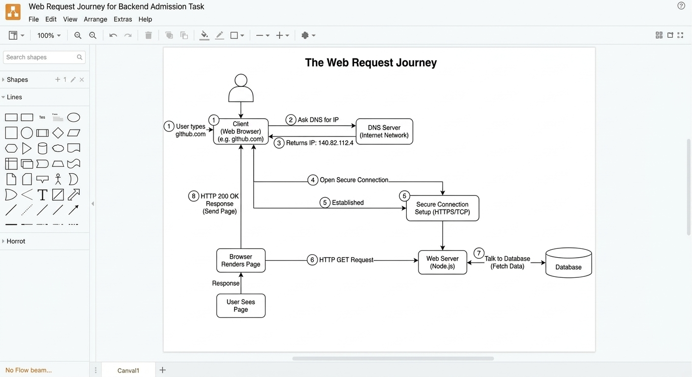

# Web Request Journey Task

**Name:** خالد محمد احمد السيد المصري

## Diagram Explaining the Journey

## Simple Explanation

When I type a website address like `github.com` in my browser, a lot happens in the background.

First, the browser does not know where `github.com` is. It asks a **DNS Server** to find the numerical address (IP address) for the website. The DNS server replies with the correct IP.

After getting the address, the browser uses it to connect securely to the **Web Server** using TCP and HTTPS. This is like opening a secure channel to talk.

Next, the browser sends an **HTTP GET Request** to the Web Server, asking for the website's main page.

The Web Server's **Backend** (Node.js) processes this request. It might need to fetch some user data from the **Database**[cite: 4].

Finally, the Web Server sends back an **HTTP 200 OK Response**, which includes the website's HTML, CSS, and JS files. The browser receives these files and renders the final page for the user to see[cite: 4].